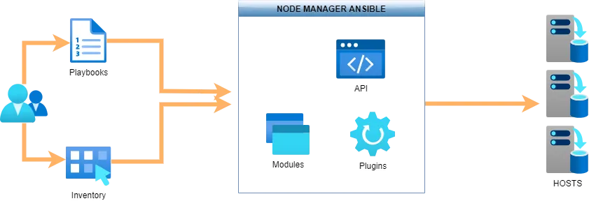

ANSIBLE 
-------

## Composants

- **Node Manager**: ou control node, est le poste depuis lequel tout est exécuté via des connexions, essentiellement en SSH, aux nœuds cibles.

- **Playbook:** Un playbook Ansible décrit une suite de tâches ou de rôles écrits dans un fichier ou format yaml.

- **Rôle**: Afin d’éviter d’écrire encore et encore le même code dans `les playbooks`, Ansible permet d’utiliser des librairies regroupant des fonctionnalités spécifiques. Ces librairies sont appelées des rôles qui peuvent donc être utilisés dans les playbooks.

- **Inventory**: La description des systèmes cibles gérés par Ansible est appelé un inventaire. A chaque node de l’inventaire, on peut attribuer des variables. On distingue deux types d’inventaire :
    l’inventaire statique constitué de fichier(s) plats.
    l’inventaire dynamique fourni par un système centralisé. Exemple L’inventaire AWS EC2.

- **Module**: Les tâches et les rôles font appel à des modules installés avec Ansible. Je vous invite à consulter leur liste sur le site d’Ansible.

- **Template**: Comme son nom l’indique, un template est un modèle permettant de générer un fichier cible. Ansible utilise Jinja2, un gestionnaire de modèles écrit pour Python. Les « Templates » Jinja2 permettent de gérer des boucles, des tests logiques, des listes ou des variables.

- **Notifier**: indique que si une tâche change d’état (et uniquement si la tâche a engendré un changement), notify fait appel au handler associé pour exécuter une autre tâche.

- **Handler**: Tâche qui n’est appelée que dans l’éventualité où un notifier est invoqué
- **Tag**: Nom défini sur une ou plusieurs tâches qui peuvent être utilisé plus tard pour exécuter exclusivement cette ou ces tâches Ansible.