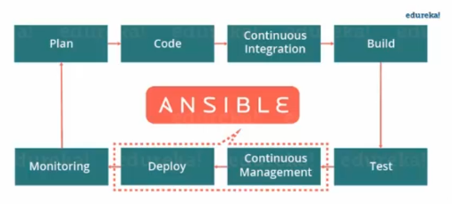

**ANSIBLE POUR DEVOPS**
----------------------

**Objectifs:**

- Automatiser un parc
- Faciliter la mise à jour et la maintenabilité d'un SI

**Themes:**

- Automatisation du déploiement des applications
  - Commandes AD-HOC
- **`Inventaire`** ansible
- Création de **`playbook`**
  - Les environnements de `dev` - `recette` - `production`
- Templating et loop - Condition
- Sécurité
  - Cryptage
  - Vault
- Création de **`rôle`**
- Installation de service sur des hôtes distants
- Déployer des vm sur `AWS` à l'aide d'ansible
- `AWX` Tower:
  - `UI`
  - **`Pipelines`**
  - Déploiement dans le Cloud (`AWS`)

